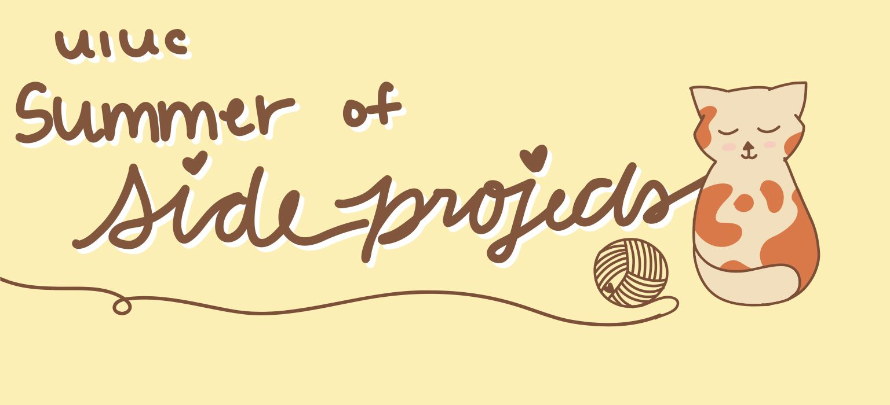

Welcome to Summer of Side Projects! All the times are in Chicago Time. Each week is completely standalone so don't worry if you miss a workshop.

🪴 Schedule 🪴

<!-- - Live Zoom Workshops: **Saturday, Noon**
  - Recordings will be posted after
- Project Ideas due: **Monday 11:59PM**
  - Feedback given by **Wednesday 11:59pm**
- Project Submission due: **Friday 11:59pm**
- Professional Development sessions will be Sunday evenings or midweek evenings. -->

<!--  -->

<!-- 
 -->

|   |   |
|:---:|:---:|
|**Monday**| Project Submission for the Previous Week Due |
|**Tuesday**| Nothing |
|**Wedneday**| Idea Submission Due |
|**Thursday**| Nothing |
|**Friday**| Workshop |
|**Saturday and Sunday**| Take a break and think of an amazing idea :)|

<!-- 
 -->